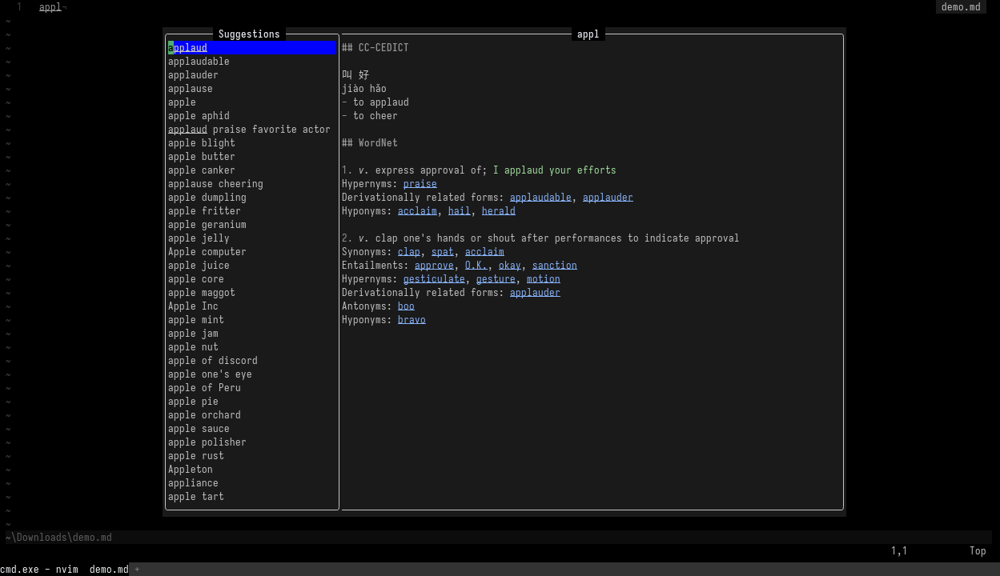

<div align="center">
  
</div>

# stardict.nvim

Local [StarDict](https://github.com/huzheng001/stardict-3) dictionaries lookup in Neovim.

Authors: Kimi-K2.7-Code🧙‍♂️, scillidan🤡

This plugin is a Windows-friendly alternative to [dict.nvim](https://github.com/jalvesaq/dict.nvim). Instead of relying on the Linux-centric `dict`/`dictd` toolchain, it reads StarDict `.ifo`/`.idx`/`.dict` files directly in pure Lua — no external binary required.

## Requirements

- Neovim 0.10+
- StarDict dictionaries (`.ifo` + `.idx` + `.dict`)

I'm using the `sdcv` version dictionaries that renders HTML using ANSI escape sequences. Find them [here](https://github.com/scillidan?tab=repositories&q=share_).

## Installation

Using [lazy.nvim](https://github.com/folke/lazy.nvim):

```lua
{
  "scillidan/stardict.nvim",
  config = function()
    require("stardict").setup({
    	-- Default options
    	-- Multiple paths supported. Set it for your platform/install method:
      --   Linux: ~/.stardict/dic, /usr/share/stardict/dic
      --   Windows: custom path with your dictionaries
      dict_dirs = {}, -- Required
      include_dictionaries = {}, -- e.g. "CC-CEDICT", "WordNet"
      exclude_dictionaries = {}, -- e.g. "GCIDE"
      dictionary_order = {}, -- e.g. "WordNet", "CC-CEDICT"
      display_mode = "split", -- Or "combined"
      ansi_colors = true,
      max_items = 100,
      window = { width = 120, list_width = 30 },
    })
  end,
}
```

## Usage

```lua
vim.keymap.set("n", "<leader>sd", function()
  require("stardict").lookup()
end, { desc = "Stardict lookup" })
```

Press `<leader>sd` on a word to open the float.

### Modes

**Combined** (exact match, `display_mode = "combined"`): single Markdown float.
- `q` / `<Esc>` — close.
- `<Enter>` — replace the original word with the word under the cursor.

**Split** (default, exact match in multiple dicts): left list, right definition.
- `<Tab>` / `<S-Tab>` — cycle dictionaries.
- `<Enter>` — focus the definition pane.
- `q` / `<Esc>` — close.

**Suggestion** (no exact match): left suggestions, right combined preview.
- `j` / `k` / `<Tab>` / `<S-Tab>` — cycle suggestions.
- `<C-e>` / `<C-y>` — scroll the right pane by one line.
- `<C-d>` / `<C-u>` — scroll the right pane by half a page.
- `<C-f>` / `<C-b>` — scroll the right pane by a full page.
- `<Enter>` or double-click — replace the original word with the selected suggestion and close.
- `q` / `<Esc>` — close.

## Configuration

| Option | Type | Description |
| :- | :- | :- |
| `dict_dirs` | `string[]` | Scanned recursively; `~` is expanded. |
| `include_dictionaries` | `string[]?` | Only these booknames. |
| `exclude_dictionaries` | `string[]?` | Exclude these booknames. |
| `dictionary_order` | `string[]?` | Fixed display order; unlisted keep discovery order. |
| `display_mode` | `"combined" \| "split"` | Default `"split"` when multiple dictionaries match. |
| `max_items` | `integer` | Max prefix suggestions. |
| `ansi_colors` | `boolean` | Render ANSI colors as highlights. |
| `window.width` | `integer` | Total float width. |
| `window.height` | `integer?` | Auto-sized if unset. |
| `window.list_width` | `integer` | Left list width in split/suggestion modes. |

## See also

- [Dict.nvim](https://github.com/jalvesaq/dict.nvim)
